# 🛡️ Cloakfox fingerprint coverage

> **At a glance:** Cloakfox intercepts **83 fingerprinting signals** across the browser. Most are spoofed at the **C++ engine level** (undetectable to JavaScript), driven by a WebExtension that generates **per-container, per-domain unique values**. Another 15 signals are out of scope (wrong layer) or genuinely not portable.

   

---

## 📖 How this works

Cloakfox spoofs fingerprints at **three layers that cooperate**:

```mermaid
flowchart LR
    U[🧑 User visits site] --> E[🔌 Cloakfox Shield extension<br/>at document_start]
    E -->|generates per-container+domain<br/>profile values| B[📦 MaskConfig overlay<br/>cloak_cfg_&lt;userContextId&gt;]
    E -.->|individual WebIDL<br/>setters| B
    E -.->|batched<br/>setCloakConfig JSON| B
    W[🌐 Web page JS:<br/>canvas.toDataURL&#40;&#41;<br/>navigator.userAgent<br/>getBoundingClientRect&#40;&#41;] --> C[⚙️ Gecko C++<br/>patched functions]
    C -->|reads| B
    C -->|returns spoofed<br/>value| W
    P[📄 cloakfox.cfg prefs] -.->|static fallback| C

    style E fill:#ffd59b
    style B fill:#b3e6ff
    style C fill:#ffb3b3
    style P fill:#d9f2d9
```



**Layer summary**

| Layer | Role | Detectable? |
|---|---|---|
| ⚙️ **C++ engine patch** | Actual spoof site — overrides the native function that fingerprinters call | ❌ No — it IS the engine |
| 🔌 **Extension (JS)** | Generates per-container values, writes them to MaskConfig at document_start. Also runs JS wrappers for a few signals without a C++ hook. | Mostly ❌ (stealth.ts patches `Function.toString`). A few JS-only wrappers are detectable with deep probing. |
| 📄 **Preference** | Static global in `settings/cloakfox.cfg` — used for signals that don't vary per-container (buildID, timer precision, mDNS) | ❌ (just a pref) |

---

## 🏷️ Reading the tables

- 🔴 = high fingerprint risk · 🟡 = medium · 🟢 = low / defensive
- ⚙️ = C++ patch · 🔌 = extension JS · 📄 = pref · 🌐 = HTTP / network layer
- 🔒 = per-container unique · 🌍 = global (same across containers by design)
- Source columns:
  - ☑ **FF** — native Firefox static value or pre-existing RFP handling
  - ☑ **CF** — ⬆ upstream **Camoufox** (inherited)
  - ☑ **CX** — 🆕 new on **Cloakfox** `unified-maskconfig` branch

---

## 🧭 Navigator

> What fingerprinters read: browser identity, platform, hardware class, API availability.

| Signal | 🎯 Risk | 🔧 Site | 🔁 Scope | FF | CF | CX |
|---|:-:|:-:|:-:|:-:|:-:|:-:|
| `navigator.userAgent` | 🔴 | ⚙️ | 🔒 | ☐ | ☑ | ☐ |
| `navigator.platform` | 🔴 | ⚙️ | 🔒 | ☐ | ☑ | ☐ |
| `navigator.oscpu` | 🟡 | ⚙️ | 🔒 | ☐ | ☑ | ☐ |
| `navigator.appVersion` | 🟡 | ⚙️ | 🔒 | ☐ | ☑ | ☐ |
| `navigator.language` / `.languages` | 🔴 | ⚙️ | 🔒 | ☐ | ☑ | ☐ |
| `navigator.hardwareConcurrency` | 🔴 | ⚙️ | 🔒 | ☐ | ☑ | ☐ |
| `navigator.maxTouchPoints` | 🟡 | ⚙️ | 🔒 | ☐ | ☐ | ☑ |
| `navigator.webdriver` | 🔴 (bot-detect) | ⚙️ | 🔒 | ☐ | ☐ | ☑ |
| `navigator.globalPrivacyControl` | 🟡 | ⚙️ | 🔒 | ☐ | ☑ | ☐ |
| `navigator.gpu` (WebGPU) | 🔴 | ⚙️ | 🔒 | ☐ | ☐ | ☑ |
| `navigator.vibrate()` | 🟢 | ⚙️ | 🔒 | ☐ | ☐ | ☑ |
| `navigator.getGamepads()` | 🟢 | ⚙️ | 🔒 | ☐ | ☐ | ☑ |
| `navigator.requestMIDIAccess()` | 🟢 | ⚙️ | 🔒 | ☐ | ☐ | ☑ |
| `navigator.requestMediaKeySystemAccess()` (EME/Widevine) | 🔴 | ⚙️ | 🔒 | ☐ | ☐ | ☑ |
| `navigator.clipboard.read/write` | 🟢 | ⚙️ | 🔒 | ☐ | ☐ | ☑ |
| `navigator.permissions.query()` | 🔴 | ⚙️ | 🔒 | ☐ | ☐ | ☑ |
| `navigator.vendor` / `.product` / `.appName` | 🟢 (static) | ⚙️ | 🌍 | ☑ | ☐ | ☐ |
| `navigator.buildID` | 🟡 | 📄 | 🌍 | ☐ | ☐ | ☑ |

---

## 🎨 Canvas, SVG, Layout

> What fingerprinters read: pixel-exact rendering differences, layout measurements, text metrics. One of the strongest fingerprint families.

| Signal | 🎯 Risk | 🔧 Site | 🔁 Scope | FF | CF | CX |
|---|:-:|:-:|:-:|:-:|:-:|:-:|
| `CanvasRenderingContext2D.getImageData` / `toDataURL` | 🔴 | ⚙️ | 🔒 | ☐ | ☑ | ☐ |
| `measureText()` TextMetrics | 🔴 | ⚙️ | 🔒 | ☐ | ☐ | ☑ |
| `OffscreenCanvas` (rides on canvas seed) | 🔴 | ⚙️ | 🔒 | ☐ | ☑ | ☐ |
| `Element.getBoundingClientRect` | 🔴 | ⚙️ | 🔒 | ☐ | ☐ | ☑ |
| `Element.getClientRects` | 🔴 | ⚙️ | 🔒 | ☐ | ☐ | ☑ |
| `Element.offsetWidth/Height/Left/Top` | 🔴 (font detect) | ⚙️ | 🔒 | ☐ | ☐ | ☑ |
| `Range.getBoundingClientRect` / `getClientRects` | 🔴 | ⚙️ | 🔒 | ☐ | ☐ | ☑ |
| `SVGTextContentElement.getComputedTextLength` | 🟡 | ⚙️ | 🔒 | ☐ | ☐ | ☑ |
| `SVGGraphicsElement.getBBox` | 🟡 | ⚙️ | 🔒 | ☐ | ☐ | ☑ |
| `document.body.client*` rect | 🟡 | ⚙️ | 🔒 | ☐ | ☑ | ☐ |

---

## 🔊 Audio

> What fingerprinters read: float precision of audio processing — differs per audio stack / DSP version.

| Signal | 🎯 Risk | 🔧 Site | 🔁 Scope | FF | CF | CX |
|---|:-:|:-:|:-:|:-:|:-:|:-:|
| `AudioBuffer.getChannelData` (noise) | 🔴 | ⚙️ | 🔒 | ☐ | ☑ | ☐ |
| `OfflineAudioContext` rendering | 🔴 | ⚙️ | 🔒 | ☐ | ☑ | ☐ |
| `AudioContext.sampleRate` | 🟡 | ⚙️ | 🔒 | ☐ | ☑ | ☐ |
| `AudioContext.outputLatency` | 🟡 | ⚙️ | 🔒 | ☐ | ☑ | ☐ |
| `AudioContext.maxChannelCount` | 🟡 | ⚙️ | 🔒 | ☐ | ☑ | ☐ |

---

## 🖼️ WebGL / WebGPU / GPU

> What fingerprinters read: exact GPU model, driver version, supported extensions. Very strong identity signal.

| Signal | 🎯 Risk | 🔧 Site | 🔁 Scope | FF | CF | CX |
|---|:-:|:-:|:-:|:-:|:-:|:-:|
| `WebGLRenderingContext.getParameter(VENDOR)` | 🔴 | ⚙️ | 🔒 | ☐ | ☑ | ☐ |
| `.getParameter(RENDERER)` | 🔴 | ⚙️ | 🔒 | ☐ | ☑ | ☐ |
| All other WebGL `getParameter` values | 🔴 | ⚙️ | 🔒 | ☐ | ☑ | ☐ |
| `getSupportedExtensions()` | 🔴 | ⚙️ | 🔒 | ☐ | ☑ | ☐ |
| `getShaderPrecisionFormat()` | 🔴 | ⚙️ | 🔒 | ☐ | ☑ | ☐ |
| `navigator.gpu.requestAdapter()` (WebGPU) | 🔴 | ⚙️ | 🔒 | ☐ | ☐ | ☑ |

---

## 🖥️ Screen & Window

> What fingerprinters read: display geometry, multi-monitor config, zoom, DPR. Reveals device class.

| Signal | 🎯 Risk | 🔧 Site | 🔁 Scope | FF | CF | CX |
|---|:-:|:-:|:-:|:-:|:-:|:-:|
| `screen.width` / `height` | 🔴 | ⚙️ | 🔒 | ☐ | ☑ | ☐ |
| `screen.availWidth` / `availHeight` | 🔴 | ⚙️ | 🔒 | ☐ | ☑ | ☐ |
| `screen.colorDepth` / `pixelDepth` | 🟡 | ⚙️ | 🔒 | ☐ | ☑ | ☐ |
| `screen.orientation.type` | 🟡 | ⚙️ | 🔒 | ☐ | ☐ | ☑ |
| `window.innerWidth` / `innerHeight` | 🔴 | ⚙️ | 🔒 | ☐ | ☑ | ☐ |
| `window.outerWidth` / `outerHeight` | 🔴 | ⚙️ | 🔒 | ☐ | ☑ | ☐ |
| `window.screenX` / `screenY` | 🟡 | ⚙️ | 🔒 | ☐ | ☑ | ☐ |
| `window.scrollMaxX/Y`, `pageX/YOffset` | 🟡 | ⚙️ | 🔒 | ☐ | ☑ | ☐ |
| `window.devicePixelRatio` | 🔴 | ⚙️ | 🔒 | ☐ | ☑ | ☐ |
| `window.visualViewport` scale/offsets | 🟡 | ⚙️ | 🔒 | ☐ | ☐ | ☑ |
| `window.name` | 🟢 | ⚙️ | 🔒 | ☐ | ☐ | ☑ |

---

## 🌍 Locale / Timezone / Intl

| Signal | 🎯 Risk | 🔧 Site | 🔁 Scope | FF | CF | CX |
|---|:-:|:-:|:-:|:-:|:-:|:-:|
| `Intl.DateTimeFormat().resolvedOptions().timeZone` | 🔴 | ⚙️ | 🔒 | ☐ | ☑ | ☐ |
| `Date.getTimezoneOffset()` | 🔴 | ⚙️ | 🔒 | ☐ | ☑ | ☐ |
| `Intl.*` locale (language/region/script) | 🔴 | ⚙️ | 🔒 | ☐ | ☑ | ☐ |

---

## 🎥 Media & Codecs

> What fingerprinters read: which codecs are hardware-accelerated on this device. Leaks GPU class and OS version.

| Signal | 🎯 Risk | 🔧 Site | 🔁 Scope | FF | CF | CX |
|---|:-:|:-:|:-:|:-:|:-:|:-:|
| `HTMLMediaElement.canPlayType()` | 🔴 | ⚙️ | 🔒 | ☐ | ☐ | ☑ |
| `MediaSource.isTypeSupported()` | 🔴 | ⚙️ | 🔒 | ☐ | ☐ | ☑ |
| `MediaCapabilities.decodingInfo` / `encodingInfo` | 🔴 | ⚙️ | 🔒 | ☐ | ☐ | ☑ |
| Speech synthesis voices | 🔴 | ⚙️ | 🔒 | ☐ | ☑ | ☐ |

---

## 🗂️ Storage

| Signal | 🎯 Risk | 🔧 Site | 🔁 Scope | FF | CF | CX |
|---|:-:|:-:|:-:|:-:|:-:|:-:|
| `navigator.storage.estimate()` | 🟡 | ⚙️ | 🔒 | ☐ | ☐ | ☑ |
| `navigator.storage.persisted()` | 🟡 | ⚙️ | 🔒 | ☐ | ☐ | ☑ |
| `indexedDB.databases()` | 🟡 (cross-site leak) | ⚙️ | 🔒 | ☐ | ☐ | ☑ |
| `history.length` | 🟡 | ⚙️ | 🔒 | ☐ | ☑ | ☐ |

---

## 🌐 Network

| Signal | 🎯 Risk | 🔧 Site | 🔁 Scope | FF | CF | CX |
|---|:-:|:-:|:-:|:-:|:-:|:-:|
| WebRTC local IP (ICE candidates) | 🔴 | ⚙️ | 🔒 | ☐ | ☑ | ☐ |
| WebRTC mDNS hostnames | 🟡 | 📄 | 🌍 | ☐ | ☐ | ☑ |
| `WebSocket` constructor (block) | 🟢 | ⚙️ | 🔒 | ☐ | ☐ | ☑ |
| `navigator.geolocation.*` | 🔴 | ⚙️ | 🔒 | ☐ | ☑ | ☐ |
| `navigator.mediaDevices.enumerateDevices` | 🔴 | ⚙️ | 🔒 | ☐ | ☑ | ☐ |
| HTTP `User-Agent` header | 🔴 | 🌐 | 🔒 | ☐ | ☑ | ☐ |
| HTTP `Accept-Language` header | 🔴 | 🌐 | 🔒 | ☐ | ☑ | ☐ |
| HTTP `Accept-Encoding` header | 🟡 | 🌐 | 🔒 | ☐ | ☑ | ☐ |
| Client Hints `Sec-CH-UA-*` headers | 🔴 | 🔌 (webRequest) | 🔒 | ☐ | ☐ | ☑ |

---

## 🔋 Hardware APIs

| Signal | 🎯 Risk | 🔧 Site | 🔁 Scope | FF | CF | CX |
|---|:-:|:-:|:-:|:-:|:-:|:-:|
| `navigator.getBattery()` | 🟡 | ⚙️ + 📄 | 🔒 | ☐ | ☑ | ☑ |

---

## 🔤 Fonts

> What fingerprinters read: installed font list. Strong OS / software identity signal.

| Signal | 🎯 Risk | 🔧 Site | 🔁 Scope | FF | CF | CX |
|---|:-:|:-:|:-:|:-:|:-:|:-:|
| System font list enumeration | 🔴 | ⚙️ | 🔒 | ☐ | ☑ | ☐ |
| Font spacing seed (CSS font-width detection) | 🔴 | ⚙️ | 🔒 | ☐ | ☑ | ☐ |

---

## ⏱️ Timing

> What fingerprinters read: `performance.now()` precision, setTimeout jitter patterns, clock drift.

| Signal | 🎯 Risk | 🔧 Site | 🔁 Scope | FF | CF | CX |
|---|:-:|:-:|:-:|:-:|:-:|:-:|
| `setTimeout` / `setInterval` jitter | 🔴 | ⚙️ | 🔒 | ☐ | ☐ | ☑ |
| `performance.now()` precision | 🔴 | 📄 | 🌍 | ☑ | ☐ | ☑ |
| `performance.timeOrigin` | 🟡 | ⚙️ (Firefox RFP) | 🌍 | ☑ | ☐ | ☐ |

---

## 🔔 Permissions & Notifications

| Signal | 🎯 Risk | 🔧 Site | 🔁 Scope | FF | CF | CX |
|---|:-:|:-:|:-:|:-:|:-:|:-:|
| `Notification.permission` | 🔴 | ⚙️ | 🔒 | ☐ | ☐ | ☑ |
| `Notification.requestPermission()` | 🔴 | ⚙️ | 🔒 | ☐ | ☐ | ☑ |

---

## 🎨 CSS Media Queries (content-only)

> What fingerprinters read: user OS preferences — dark mode, reduced motion, high contrast. These directly reveal user accessibility settings.
>
> **Important:** All patches here are content-only. Browser UI still follows your real OS (dark theme if you like dark). Only web pages see spoofed values.

| Signal | 🎯 Risk | 🔧 Site | 🔁 Scope | FF | CF | CX |
|---|:-:|:-:|:-:|:-:|:-:|:-:|
| `@media (prefers-color-scheme)` | 🔴 | ⚙️ content-only | 🔒 | ☐ | ☐ | ☑ |
| `@media (prefers-reduced-motion)` | 🔴 | ⚙️ content-only | 🔒 | ☐ | ☐ | ☑ |
| `@media (prefers-reduced-transparency)` | 🟡 | ⚙️ content-only | 🔒 | ☐ | ☐ | ☑ |
| `@media (prefers-contrast)` | 🟡 | ⚙️ content-only | 🔒 | ☐ | ☐ | ☑ |
| `@media (inverted-colors)` | 🟡 | ⚙️ content-only | 🔒 | ☐ | ☐ | ☑ |

---

## 📄 Document

| Signal | 🎯 Risk | 🔧 Site | 🔁 Scope | FF | CF | CX |
|---|:-:|:-:|:-:|:-:|:-:|:-:|
| `document.lastModified` | 🟡 (date leak) | ⚙️ | 🔒 | ☐ | ☐ | ☑ |

---

## 🔐 Anti-detection (JS-only — stays in extension)

> These signals genuinely can't be C++-spoofed without breaking things. The extension's stealth layer handles them.

| Signal | 🎯 Risk | 🔧 Site | 🔁 Scope | FF | CF | CX |
|---|:-:|:-:|:-:|:-:|:-:|:-:|
| `Error().stack` format | 🔴 | 🔌 stealth.ts | 🔒 | ☐ | ☐ | ☑ |
| `Function.prototype.toString` native-look | 🔴 | 🔌 stealth.ts | 🔒 | ☐ | ☐ | ☑ |
| iframe spoofing inheritance | 🔴 | 🔌 iframe-patcher | 🔒 | ☐ | ☐ | ☑ |
| Worker thread consistency | 🔴 | ⚙️ WorkerNavigator | 🔒 | ☐ | ☑ | ☐ |
| KeyboardEvent cadence timing | 🟡 | 🔌 keyboard/cadence | 🔒 | ☐ | ☐ | ☑ |
| Feature detection consistency (`CSS.supports`) | 🟡 | 🔌 features | 🔒 | ☐ | ☐ | ☑ |
| `Math.*` trig precision | 🟡 | 🔌 math | 🔒 | ☐ | ☐ | ☑ |

---

## 🎛️ Cloakfox extension orchestration

> The extension is what makes everything per-container. Without it, the C++ patches default to real browser values.

| Responsibility | Layer | Source |
|---|:-:|:-:|
| Per-domain deterministic profile (UA, screen, fonts, GPU, timezone, locale) | 🔌 | CX |
| Per-container master seed + xorshift128+ sub-PRNG derivation | 🔌 | CX |
| Calls individual WebIDL setters at `document_start` | 🔌 | CX |
| Batched `setCloakConfig()` JSON for keys without individual setters | 🔌 | CX |
| Container lifecycle (create / delete / rotate / persist) | 🔌 | CX |
| Settings UI (popup, options, signal monitor) | 🔌 | CX |
| HTTP request header rewriting (webRequest API) | 🔌 | CX |
| IP leak warning + proxy validation | 🔌 | CX |

---

## ❌ Remaining gaps

| Signal | Proposed layer | Effort | Why not done |
|---|---|:-:|---|
| `@media (color-gamut)` | ⚙️ nsMediaFeatures.cpp | 🟢 low | low priority, rare FP signal |
| `@media (dynamic-range)` HDR | ⚙️ nsMediaFeatures.cpp | 🟢 low | rare |
| `@media (resolution)` DPI | ⚙️ nsMediaFeatures.cpp | 🟢 low | DPR already covered |
| `SVGGraphicsElement.getCTM` / `getScreenCTM` | ⚙️ | 🟢 low | SVG bbox covers main vector |
| `SVGGeometryElement.getTotalLength` / `getPointAtLength` | ⚙️ | 🟢 low | rarely FP'd |
| `FontFaceSet.check()` | ⚙️ | 🟡 med | font list + spacing seed cover primary vector |
| `getComputedStyle()` font-family fallback | ⚙️ | 🟡 med | font list covers primary vector |
| `HTMLMediaElement.duration` precision | ⚙️ | 🟡 med | risk of breaking playback |
| `Document.compatMode` / `characterSet` / `contentType` | ⚙️ | 🟢 low | already static across all Firefox installs |
| Math trig precision (SpiderMonkey-level) | 🔧 SM | 🔴 high | JIT / debug risk. JS spoofer handles. |
| `Error().stack` at engine level | 🔧 SM | 🔴 high | JS spoofer handles |
| `KeyboardEvent.timeStamp` at engine | ⚙️ events | 🔴 high | breaks input semantics. JS spoofer handles. |
| TLS JA3/JA4 fingerprint | NSS | — | ❌ out of Gecko scope |
| HTTP/2 SETTINGS frame ordering | netwerk | 🔴 high | rarely FP'd in practice |
| TCP stack fingerprint | OS | — | ❌ impossible from browser |

---

## 🚫 Firefox doesn't implement — JS spoofers were deleted

Verified via `grep dom/webidl/` — zero matches. The JS spoofers for these APIs were removed (1046 lines of dead code).

| API | Reason Firefox doesn't have it |
|---|---|
| Web Bluetooth (`navigator.bluetooth`) | Mozilla position: "harmful" |
| WebUSB (`navigator.usb`) | Same |
| WebSerial (`navigator.serial`) | Same |
| WebHID (`navigator.hid`) | Same |
| Generic Sensor API (Accelerometer/Gyroscope/Magnetometer) | "harmful", leaks physical device |
| `Screen.isExtended` (Window Management) | Not shipped |
| Keyboard API (`navigator.keyboard`) | Not shipped |
| ApplePaySession | Safari proprietary |
| WebSQL | Removed from all browsers |
| `performance.memory` | Chrome-only |
| `navigator.deviceMemory` | Chrome-only |
| NetworkInformation (`navigator.connection`) | `dom.netinfo.enabled=false` default |

---

## 📊 Summary

```
─────────────────────────────────────────────────────────
 83  signals covered
     ├─ 52 ⚙️ C++ engine patches (undetectable)
     │    ├─ 27 inherited from Camoufox upstream
     │    └─ 25 new on Cloakfox unified-maskconfig
     ├─ 11 🌐 HTTP / webRequest (Camoufox + CH by CX)
     ├─  7 🔌 JS-only (stealth / math / keyboard / etc)
     ├─  8 📄 prefs (cloakfox.cfg)
     └─  4 🛡️ native Firefox statics

 76  per-container unique (76/83 = 92 %)
  7  global (buildID, timer precision, mDNS, native statics)

 15  remaining gaps (low-value or out-of-scope)
 12  APIs Firefox doesn't implement (JS spoofers deleted)
─────────────────────────────────────────────────────────
```

**Fingerprint resistance scorecard:**

```
Canvas / Rendering  ████████████████████ 100 %
Audio               ████████████████████ 100 %
Navigator           ████████████████████ 100 %
Screen / Window     ████████████████████ 100 %
WebGL / WebGPU      ████████████████████ 100 %
Media codecs        ████████████████████ 100 %
Locale / Timezone   ████████████████████ 100 %
Storage             ████████████████████ 100 %
Fonts               ████████████████████ 100 %
CSS media queries   ████████████████░░░░  80 %   (color-gamut, resolution, HDR left)
Document            ████████████████░░░░  80 %   (compat/characterSet minor)
SVG                 ████████████░░░░░░░░  60 %   (CTM/geometry remain, low-value)
Timing              ████████████████████ 100 %
Anti-detection      ████████████████████ 100 %
```
